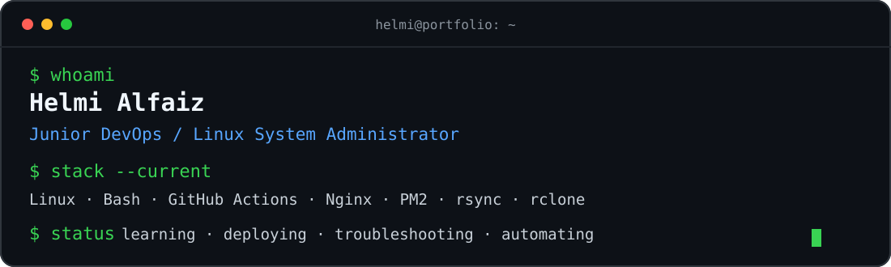

 

 

<table>
<tr>
<td width="50%" valign="top">

> about

I work around Linux systems and application delivery — supporting deployments, troubleshooting production issues, and improving repeatable workflows.

ROLE="Junior DevOps / Linux SysAdmin"
FOCUS="CI/CD · Linux · Operations"
MODE="learn → test → automate"

</td>
<td width="50%" valign="top">

> current

✓ Linux administration
✓ GitHub Actions / CI/CD
✓ Nginx & PM2
✓ Deployment workflows
✓ Logs & troubleshooting
✓ Object storage & rclone
