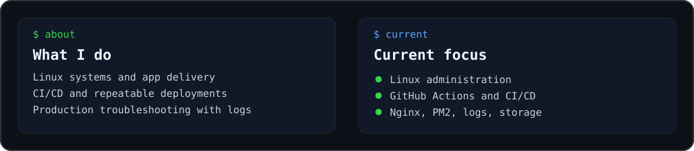

 

 

### `> toolbox`

 

<table>
<tr>
<td align="center"><b>Systems</b> Linux · CentOS · services · storage</td>
<td align="center"><b>Delivery</b> GitHub Actions · Bash · Git · rsync</td>
<td align="center"><b>App Ops</b> Nginx · PM2 · Next.js · Express · Laravel</td>
<td align="center"><b>Observability</b> Logs · Prometheus · troubleshooting</td>
</tr>
</table>

 

<a href="https://helmialfaiz79.github.io/"><b>Portfolio</b></a>
&nbsp;·&nbsp;
<a href="https://github.com/helmialfaiz79"><b>GitHub</b></a>
&nbsp;·&nbsp;
<a href="mailto:helmialfaiz76@gmail.com"><b>Email</b></a>
&nbsp;·&nbsp;
<a href="https://www.linkedin.com/in/helmi-alfaiz-6377a4141"><b>LinkedIn</b></a>
&nbsp;·&nbsp;
<a href="https://www.instagram.com/helmialfaiz"><b>Instagram</b></a>

  

<code>helmi@github:~$ learning · deploying · troubleshooting · automating</code>

